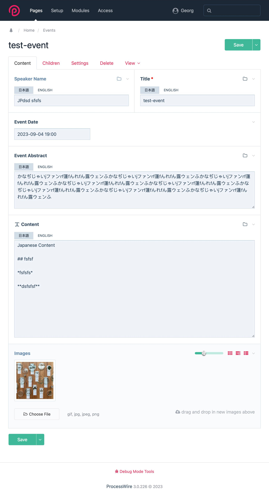
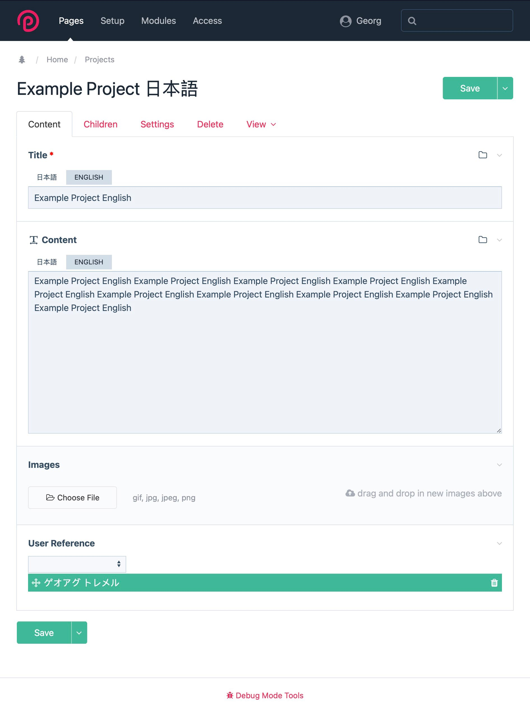
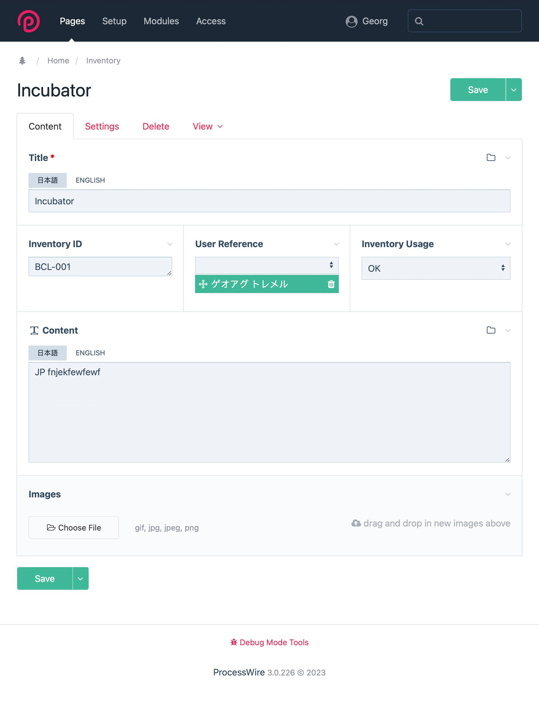

# ProcessWire Backend Examples

### Event Page

Event Custom Fields. All Custom Fields are bi-lingual, except `Date` and `Images`. Text in `Abstract` is `Content` is Markdown.

- Speaker Name
- Title
- Event Date
- Event Abstract
- Event Content
- Images

### Project Page

Project Custom Fields. All Custom Fields are bi-lingual, except `Images` and `User Reference`. Text in `Content` is Markdown. `User Reference` points to one or more Project Members.

- Title
- Content
- Images
- User Reference

### Inventory Page

Project Custom Fields. All Custom Fields are bi-lingual, except `Images`, `Inventory ID` and `User Reference`. Text in `Content` is Markdown. `User Reference` points to one or more Project Members.

- Title
- Inventory ID
- User Reference
- Inventory Usage
- Content
- Images

